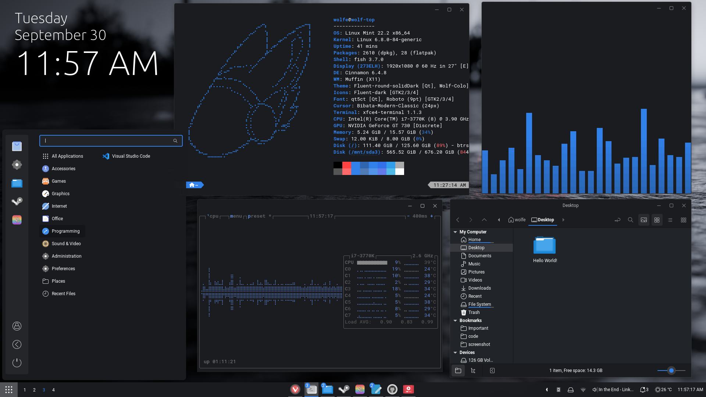
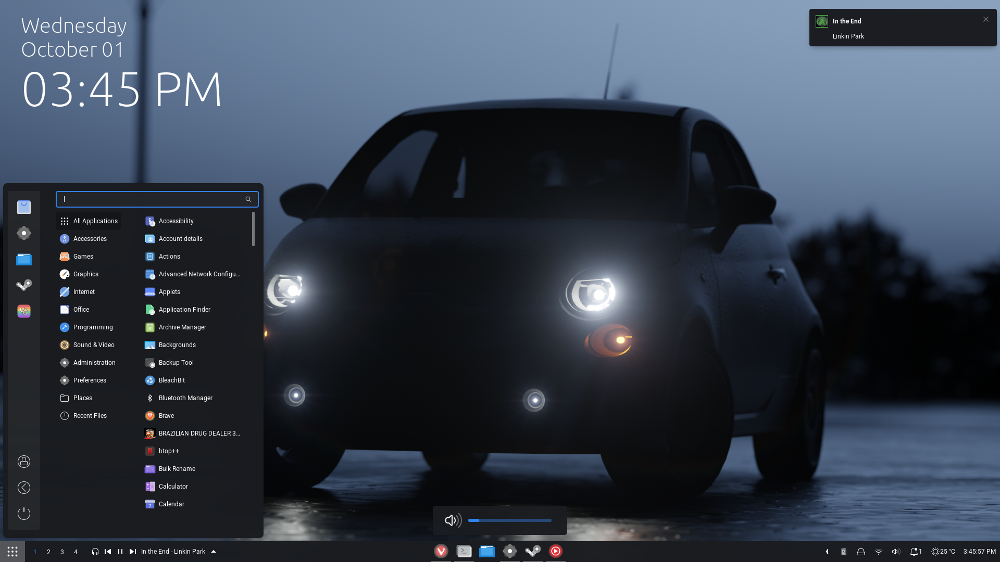

<h1 align="center">
  <br>
  </a>
  <br>
  Wolf Colors
  <br>
</h1>

<h4 align="center">
 <p>A GTK themes and more! </p>
 <br>
 <a href="https://github.com/WolftheE/Wolf-Colors/archive/refs/heads/main.zip">Download Here</a>
 <br>
</h4>

<h1 align="center">
  <br>
</h1>


<p>
    
    
</p>

> Wallpapers are in the `wallpapers` folder


### How to install (GTK)
If you have any errors make sure all of this is installed
```
- GTK `>=3.20`
- `gnome-themes-extra` (or `gnome-themes-standard`)
- Murrine engine — The package name depends on the distro.
  - `gtk-engine-murrine` on Arch Linux
  - `gtk-murrine-engine` on Fedora
  - `gtk2-engine-murrine` on openSUSE
  - `gtk2-engines-murrine` on Debian, Ubuntu, etc.
- `sassc` — build dependency
```


1. Download with the link above and it should be a zip file called `main.zip`, extract it!
2. Open the folder and there should be a folder called `gtk_theme`, open it!
3. There should be 2 scripts called `install.sh` and `parse-sass.sh`
4. >(Optional but recomended) Execute the `parse-saas.sh` file
5. Then Execute the `install.sh` (use sudo to install it system-wide)
6. Then apply it and enjoy!


>[!Note]
> You can use the following Agurments with `./install.sh` to fine tune the theme!:

```
-l, --libadwaita        Install GTK4 theme as well!

-d, --dest DIR          Specify destination directory (Default: /usr/share/themes)

-t, --theme VARIANT     Specify theme color variant(s) [default|purple|pink|red|orange|yellow|green|grey|teal|all] (Default: blue)

-c, --color VARIANT     Specify color variant(s) [standard|light|dark] (Default: All variants)

-s, --size VARIANT      Specify size variant [standard|compact] (Default: All variants)

-i, --icon VARIANT      Specify icon variant(s) for shell panel
                        [default|apple|simple|gnome|ubuntu|arch|manjaro|fedora|debian|void|opensuse|popos|mxlinux|zorin|endeavouros|tux|nixos]
                        (Default: Windows icon)


-u, --uninstall         Uninstall themes or link for libadwaita

--tweaks                Specify versions for tweaks [solid|float|round|blur|noborder|square]
                        solid:    no transparency version
                        round:    rounded windows
                        blur:     Transparent windows (work best with blur-my-shell)
                        noborder: windows and menu with no border
                        float:    floating panel (gnome)

-h, --help              Show help
```

### Others/tips
>[!note]
>More to come soon

1. In Vivaldi go to themes and click on Import theme
2. Go to `other_themes` and chose `Vivaldi-wolf-colors-dark.zip`
3. Apply the theme and enjoy
> 4. (Optional) You can download a custom Vivaldi css mod (here)[https://github.com/WolftheE/Another-Vivaldi-css-theme]


<p>The font I use is `Roboto` becuase everyone loves the font :)</p>
<p>I also recomend the [Fluent icon theme](https://github.com/vinceliuice/Fluent-icon-theme) but you can use whatever you like </p>


### About/Thanks
This Theme's code is based on the Fluent theme by Vinceliuice -[Github here](https://github.com/vinceliuice/Fluent-gtk-theme)-

